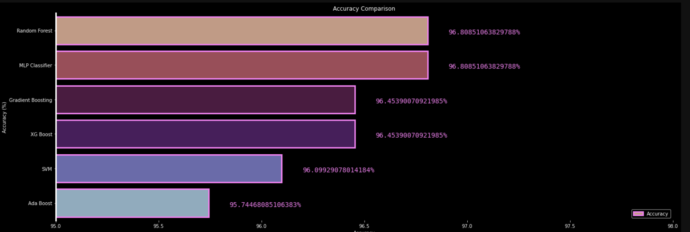

# Oil spill

## Introduction

This is a project that uses machine learning to detect oil spills. The dataset was developed by starting with satellite images of the ocean, some of which contain an oil spill and some that do not.
Images were split into sections and processed using computer vision algorithms to provide a vector of features to describe the contents of the image section or patch.
The task is, given a vector that describes the contents of a patch of a satellite image, then predicts whether the patch contains an oil spill or not, e.g. from the illegal or accidental dumping of oil in the ocean.

There are two classes and the goal is to distinguish between spill and non-spill using the features for a given ocean patch.
All the data is taken from https://www.kaggle.com/datasets/sudhanshu2198/oil-spill-detection

## Libraries

- Python 3.7 or later
- Numpy
- Seaborn
- Matplotlib
- Pandas
- Plotly
- Sklearn
- Xgboost

## Models
I used seven models:

- [RandomForest](https://en.wikipedia.org/wiki/Random_forest)
- [GradientBoosting](https://en.wikipedia.org/wiki/Gradient_boosting)
- [SVC]( https://en.wikipedia.org/wiki/Support_vector_machine)
- [DecisionTree](https://en.wikipedia.org/wiki/Decision_tree)
- [AdaBoost](https://en.wikipedia.org/wiki/AdaBoost)
- [XGBC](https://en.wikipedia.org/wiki/XGBoost)
- [MLP](https://en.wikipedia.org/wiki/Multilayer_perceptron)


## Results

The model is evaluated on a validation set after every epoch during training and its performance is plotted to monitor overfitting. The final results on the test set are reported in terms of accuracy:

<p align="center">
   
</p>

Despite the high accuracy of the algorithms, the results are unsatisfactory. This is due to the skewed distribution of the target variable, where a majority of values are 0s with only a few 1s. As a result, the algorithms are only correctly identifying the 1s (indicating the presence of oil spills) half of the time, making their performance inconsistent. To improve the results, the algorithms would require a larger number of cases with the target value set to 1.

## Installation

Clone the repository to your local machine:

```bash
 git clone https://github.com/NicolasCort/Tumor_AI.git

```
Install the required packages using pip:

```bash
 pip install -r requirements.txt


```

## Contributions
Contributions to this project are welcome! If you want to contribute, please follow these steps:

- Fork this repository
- Clone the forked repository to your local machine
- Make the desired changes and commit them
- Push the changes to your forked repository
- Submit a pull request to this repository

